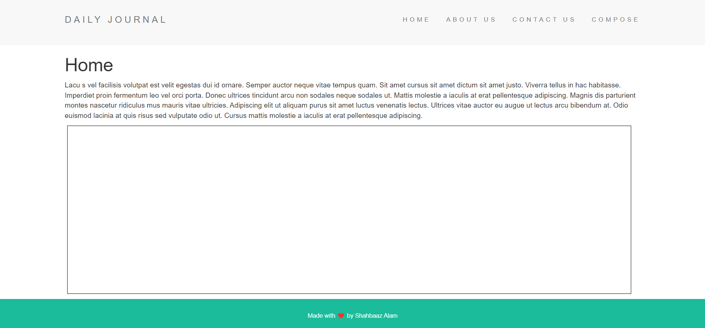

## Dairy | Blog Using EJS
> This is a daily blog project developed using Embedded Javascript (EJS), HTML,CSS,JS also a pinch of the lodash for utility and all the routing requests and handling of server requests is coded in express and served via Express server.

#### 1.Homepage

#### 2.Compose Page

#### 3.Composing/Writing a Blog Post

#### 4.Posts appear in Homepage

#### 5.Post Page
> By clicking on readme beside post you can go to the post page (view post in detailed mode).

PS: This project is a made as a challenge in the Yu Angela's Web-dev Bootcamp